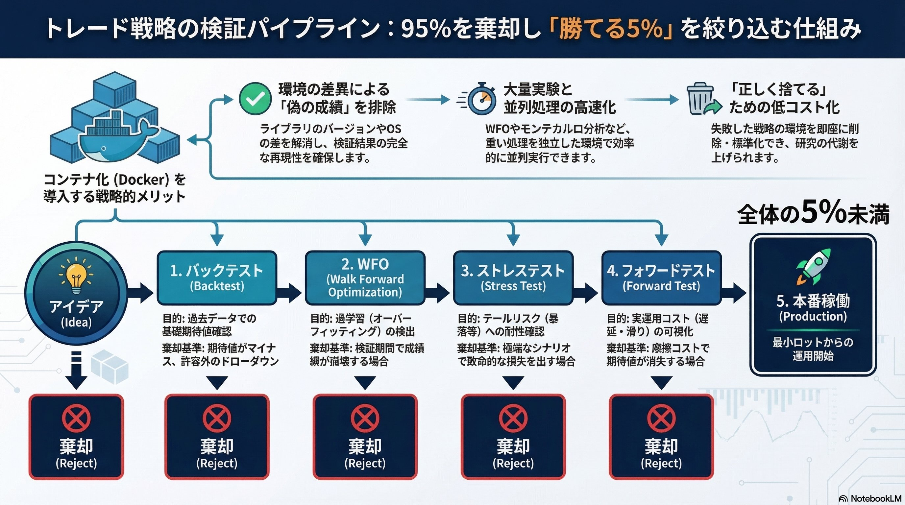
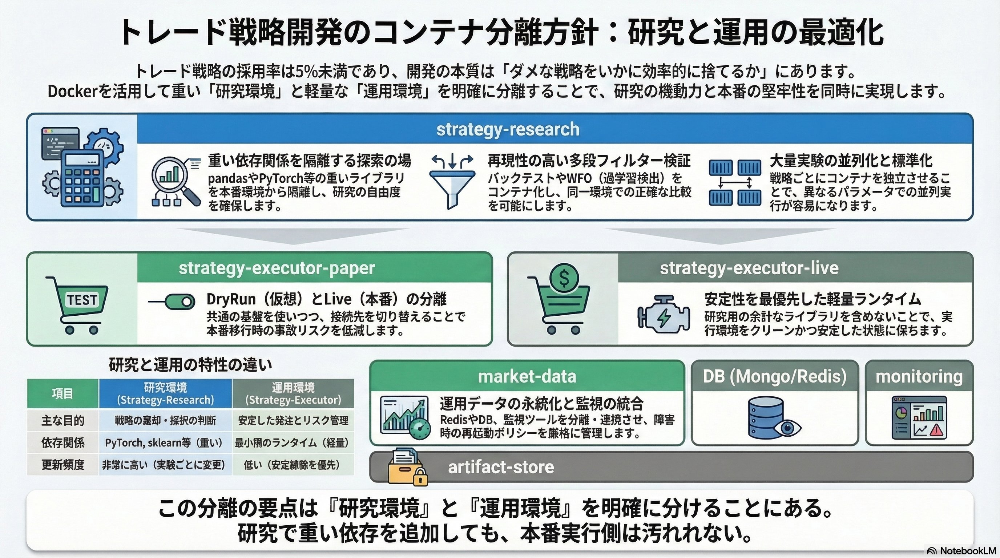

# システムトレードの検証パイプラインを Docker でコンテナ化する理由

システムトレードの現実は、勝てる戦略を作ること以上に、ダメな戦略をいかに早く、正確に、低コストで捨てるかにある。筆者の体感では、戦略アイデアが本番稼働まで到達する確率は 5% 未満だ。だから重要なのは、個々の戦略コードを磨くことだけではない。大量試行・大量棄却に耐える検証基盤を設計することだ。

本稿でいうコンテナ化とは、戦略コードを単に Docker に入れることではない。Backtest、WFO、Stress Test / Scenario Analysis、DryRun（Paper Trading）、Live Trading までを、再現可能な実験パイプラインとして分離・標準化することを指す。目的は「良い戦略を作る」ことだけではない。95% の候補を、環境差に惑わされず、正しく捨てるためである。

## 本稿でいうコンテナ化とは何か

Docker を知らない人向けに、最初に前提を短く整理しておく。コンテナは、アプリケーションと依存関係をまとめて、隔離された形で再現しやすく実行する仕組みだ。仮想マシンのように OS を丸ごと持つのではなく、ホスト OS のカーネルを共有しつつ、アプリケーションの実行環境だけを分離する。そのため起動が速く、比較的軽量に扱える。

たとえば、自分の PC では動く Python スクリプトが、別の PC では `pandas` や `numpy` のバージョン差で動かないことがある。コンテナを使うと、「コード」だけでなく「そのコードが動く環境」もまとめて固定できる。これにより、環境差で検証結果がぶれる問題をかなり減らせる。

ただし、Docker ですべての差分が消えるわけではない。CPU architecture、GPU、時刻同期、ネットワーク遅延のような差は別途意識する必要がある。ここを誤解すると、コンテナ化に過剰な期待をかけることになる。

用語も簡単に整理しておく。

- **Dockerfile**: 実行環境の設計図。どのベースイメージを使い、何をインストールし、何を実行するかを定義する
- **Docker イメージ**: Dockerfile から作られた実行可能なパッケージ
- **コンテナ**: イメージから起動した実行中のインスタンス
- **Docker Compose**: 複数のコンテナをまとめて定義・起動するための仕組み

本稿でいうコンテナ化は、戦略コード単体を Docker に入れることではない。Backtest、WFO、Stress Test / Scenario Analysis、DryRun（Paper Trading）、Live Trading までを含む検証フロー全体を、再現可能な実験パイプラインとして整備することである。

## 検証パイプラインの全体像


*アイデアから Live Trading までの検証パイプライン。多くの候補は途中で棄却され、本番到達率は低い。*

筆者が実践している検証フローは、多段フィルター型である。戦略候補は段階的にふるいにかけられ、各工程で基準を満たさなければ棄却される。重要なのは、最後に本番へ行く戦略を探すことと同じくらい、途中で落とすべき戦略を正しく落とすことである。

### Backtest

Backtest の目的は、過去データで戦略の基礎的な期待値を確認する初期選別にある。まずここで、そもそも検証を続ける価値があるかを見極める。幾何平均リターンがマイナスである、あるいは最大ドローダウンが許容範囲を超えるなら、その戦略はこの段階で棄却する。

### WFO

WFO の目的は、最適化期間と検証期間をずらしながら繰り返し評価し、過学習を検出することにある。訓練期間だけ成績が良く、検証期間で崩壊する戦略は、本番に持ち込むべきではない。市場変化への脆弱性が客観的に示された場合も、ここで棄却する。

### Stress Test / Scenario Analysis

Stress Test / Scenario Analysis の目的は、暴落、ボラティリティ急増、流動性低下のような極端シナリオに対する耐性を確認することにある。モンテカルロ法、ブートストラップ法、時系列合成などを使い、通常時には見えにくいテールリスクをあぶり出す。極端シナリオ下で致命的な損失を出す、あるいはリスクに対して期待リターンが見合わないなら棄却する。

### DryRun（Paper Trading）

DryRun（Paper Trading）の目的は、ライブデータを使いながら、バックテストでは見えない摩擦コストや運用上の問題を確認することにある。発注 API 遅延、スリッページ、タイムアウト、切断からの復旧、再送制御などがここで露わになる。摩擦コストを加味すると期待値が消える、またはシステムの安定性が不足しているなら棄却する。

### Live Trading

Live Trading の目的は、最小ロットまたは制限したポジションサイズで実際に運用することにある。ここに到達する戦略は少ない。だからこそ、そこへ至る前段の検証パイプラインを効率化する意義が大きい。

この多段フィルター型の開発では、「優れた戦略を見つける」ことと同じくらい、「ダメな戦略を大量に処分する」能力が重要になる。Docker によるコンテナ化は、その棄却プロセスの速度と精度を上げるための基盤として効く。

## 研究環境と運用環境を分ける


*研究環境、DryRun 環境、本番環境、データ取得、監視、永続化を分離した構成例。*

システムトレードのコンテナ設計で重要なのは、研究環境と運用環境を明確に分けることである。両者は目的が違う。

研究環境の目的は、戦略の採否判断を高速に回すことにある。ここでは `pandas`、`numpy`、`scikit-learn`、`PyTorch`、`JAX` のような重い依存が入ってもよい。更新頻度も高く、実験ごとに条件が変わる。多少太くても、比較の再現性と試行回数を優先する方が合理的だ。

一方、運用環境の目的は、安定した発注とリスク管理である。本番側では軽量で、変化が少なく、挙動が予測しやすいランタイムの方が望ましい。研究用の重いライブラリや notebook 周辺を本番へ持ち込むのは、不要な複雑さと事故リスクを増やすだけである。

この前提に立つと、少なくとも次のような役割分離が実務的になる。

- **strategy-research**: Backtest、WFO、Stress Test / Scenario Analysis を担当する研究環境

- **strategy-executor-paper**: DryRun（Paper Trading）を担当する実行環境

- **strategy-executor-live**: Live Trading を担当する本番実行環境

- **market-data**: 市場データの取得、正規化、前処理を担当するコンテナ

- **DB / Redis**: 状態、ジョブ、キャッシュ、ログメタデータの保存先

- **monitoring**: Prometheus や Grafana による監視と可観測性のためのコンテナ

- **artifact-store**: 結果 CSV、パラメータ、モデル、レポート、実験メタデータを保存する領域

この分離の要点は、研究で必要だが本番には不要な重い依存を、本番へ持ち込まないことにある。研究の自由度を確保しながら、運用側は軽量で保守的に保つ。この分離だけでも、研究速度と運用安定性の両立がかなりやりやすくなる。

## 工程別に、どこでコンテナ化が効くのか

### Backtest: まずは再現性に効く

Backtest でコンテナ化が最も効くのは再現性である。バックテストの成績は、見落としがちな環境差で変わることがある。Python のバージョン差、`pandas` や `numpy` のマイナーバージョン差、TA ライブラリのビルド差、BLAS / LAPACK の実装差、タイムゾーン設定、乱数 seed の扱いなどは無視できない。

コンテナ化しておけば、「この戦略の 2026 年 3 月時点の評価は、この Docker イメージで実施した」と固定しやすい。後から成績の再検証をするときも、別マシンに移すときも、まず環境差を疑う必要が減る。これは研究速度だけでなく、バグ調査やレビューの質にも直結する。

### WFO: 並列化と標準化に効く

WFO はコンテナ化との相性が非常に良い。同じ処理を、窓をずらしながら何十回、何百回と回すからである。各ジョブを独立コンテナに切り出せば、同一イメージで条件だけ変えた実行がしやすい。

戦略 ID、訓練期間、検証期間、パラメータセット、乱数 seed などを環境変数や設定ファイルで渡せば、同一イメージから異なる条件のジョブを独立に起動できる。あるジョブが失敗しても他のジョブへ波及しにくく、結果の保存形式も統一しやすい。WFO は戦略ロジックそのもの以上に、大量実験をどう管理するかが効率を左右する工程であり、コンテナ化の恩恵が大きい。

### Stress Test / Scenario Analysis: 重い依存関係の隔離に効く

Stress Test / Scenario Analysis では、研究用の重い依存関係が発生しやすい。モンテカルロシミュレーション、ブートストラップ、GAN や時系列生成モデルなどを使うなら、`PyTorch`、`JAX`、CUDA 周辺の依存が必要になることもある。

こうした依存を本番実行環境へ持ち込む必要はない。むしろ持ち込まない方がよい。コンテナで分離しておけば、研究に必要だが本番には不要なものを、研究環境だけに閉じ込められる。研究は肥大化しやすく、本番は痩せている方がよい。この原則を構成として強制しやすいのが、コンテナ化の利点である。

### DryRun（Paper Trading）: 運用設計に効く

DryRun（Paper Trading）以降は、戦略ロジックそのものより、ソフトウェア工学や運用設計の比重が上がる。ここで確認したいのは、発注 API の遅延、約定応答の癖、スリッページの実測、タイムアウト時の再送制御、接続断からの復旧、ログ収集、メトリクス監視などである。

この工程はコンテナ化との相性がよい。起動手順を固定化しやすく、ヘルスチェックを入れやすく、ログやメトリクスも集めやすい。接続先も環境変数で切り替えられるため、DryRun と Live Trading で「ロジックは同じ、接続先だけ違う」という構成を作りやすい。DryRun は単なる模擬運用ではなく、本番に近い運用設計をあぶり出す工程である。

### Live Trading: 利点は大きいが、雑にやると危ない

Live Trading でも、コンテナ化には明確な利点がある。デプロイとロールバックがしやすく、バージョン固定で安定性を保ちやすい。戦略 A と戦略 B を分離しやすく、片方の異常がもう片方に波及しにくい。

ただし、ここは注意点も多い。HFT のような超低遅延領域では、コンテナのオーバーヘッドやネットワーク構成が無視できないことがある。また、再起動ポリシーを雑に設定すると、障害時に意図しない再発注が起きる危険がある。ポジション情報や注文状態のような state 管理を誤ると、事故の原因になる。本番では「起動できること」より「安全に止まれること」の方が重要である。

## Docker で消えない差分

Docker は環境差を減らすが、運用上のすべての難しさを解決するわけではない。ここは誤解されやすいので、少なくとも次の差分は明示しておく方がよい。

第一に、**CPU architecture** の差は残る。x86_64 と ARM64 では、依存関係や挙動が変わることがある。第二に、**GPU / ドライバ** の差も残る。GPU を使うなら、ホスト側のドライバや CUDA 条件を無視できない。

第三に、**clock sync / timezone / NTP** の問題は別に残る。タイムゾーン設定だけでなく、NTP 同期やクロックのズレは、時系列処理や発注時刻の評価に影響する。第四に、**network latency / jitter** も消えない。DryRun や Live Trading では、API レイテンシ、切断、再接続、DNS 解決、TLS ハンドシェイクなどの外部要因が成績と安全性に影響する。

第五に、**state 管理** は Docker が自動で解決してくれない。ポジション情報、未約定注文、再起動後の復元などは、コンテナの外にある設計課題である。第六に、**idempotency** も別問題である。リトライ時に同じ注文や同じ処理が重複実行されない設計が必要だ。第七に、**restart policy** を雑にすると、障害時の再試行がそのまま事故につながる。第八に、**secret injection** も運用設計として扱う必要がある。API キーや認証情報をイメージに焼き込むべきではない。

要するに、Docker は「環境差を減らす道具」ではあるが、「運用上のすべての難しさを消す道具」ではない。この境界を理解しておくと、期待値が現実的になる。

## 最小構成

いきなり Kubernetes を導入する必要はない。最初は Dockerfile と Docker Compose で十分である。重要なのは、少数のコンテナでも責務を分離し、入出力と永続化を標準化することだ。

たとえば、ディレクトリ構成は次のような最小例から始められる。

```text
project/
├─ compose.yaml
├─ .env
├─ research/
│  ├─ Dockerfile
│  ├─ strategies/
│  └─ configs/
├─ executor/
│  ├─ Dockerfile
│  ├─ paper/
│  └─ live/
├─ market-data/
│  └─ Dockerfile
├─ monitoring/
│  ├─ prometheus/
│  └─ grafana/
├─ artifacts/
│  ├─ backtests/
│  ├─ wfo/
│  ├─ stress-tests/
│  └─ dryrun/
└─ logs/
```

Compose でも、最初は研究用、Paper Trading 用、本番用、データ取得、Redis、監視が分かれていれば十分である。profiles を使えば、研究時は `research` だけ、DryRun 時は `paper + market-data + redis`、本番時は `live` を中心に起動する、といった運用がしやすい。

本番で特に重要なのは、restart を無制限に任せないことである。障害時の再試行と再発注がどう結びつくかは、戦略やブローカー API の仕様に依存する。Compose だけで雑に完結させるより、リトライ、再送、復元の責務を明示的に設計した方が安全である。

## 記録すべきメタデータ

コンテナ化の効果を最大化するには、「再現できる」だけでなく「追跡できる」ことが必要である。最低でも、次のメタデータは実験結果と一緒に記録しておきたい。

| 項目 | 目的 |
| --- | --- |
| Git commit hash | 戦略コードのバージョンを特定する |
| Docker image tag | 実行環境のバージョンを特定する |
| 戦略 ID | どの戦略かを識別する |
| データバージョン | 使用したデータの版や取得範囲を特定する |
| 実験 ID | 実験単位で結果を追跡する |
| 乱数 seed | 再現性を確保する |
| 評価指標 | Sharpe ratio、最大ドローダウン、勝率などを残す |

ここまで紐づいていれば、「この本番戦略は、どの Backtest、どの WFO、どの DryRun を通過したのか」を後から追える。逆に言えば、ここが曖昧だと、コンテナ化していても研究基盤としては弱い。

## 導入順序とやりすぎ注意

すべてを一度にコンテナ化する必要はない。優先順位をつけた方がよい。

まずやるべきなのは、Backtest 実行環境、WFO 実行環境、DryRun（Paper Trading）実行環境、そして DB / ログ / 監視の周辺である。ここが揃うだけでも、検証パイプラインの再現性と運用性はかなり改善する。

次に、研究用コンテナ、実行用コンテナ、監視用コンテナを明確に分けた方がよい。責務が分かれるだけで、更新や障害の影響範囲をかなり限定しやすくなる。

一方で、Jupyter 環境の完全統一、GUI 中心の分析環境、Kubernetes によるオーケストレーションは後回しでもよい。ここを早すぎる段階でやり始めると、「戦略研究を速くする」ためのコンテナ化が、「基盤構築そのもの」が主目的になりやすい。

最初は Dockerfile、Compose、ボリューム設計、環境変数管理、実験設定ファイルが揃っていれば十分である。Kubernetes は、コンテナ数と運用負荷が本当に増えてから検討すればよい。

## まとめ

トレード戦略の検証パイプラインをコンテナ化する価値は、大きく三つある。第一に、再現性を高められること。第二に、大量実験を標準化できること。第三に、本番移行時の事故を減らしやすいことだ。

そして本質的に重要なのは、コンテナ化の価値が「優れた戦略を生み出すこと」だけにあるわけではない、という点である。むしろ、ダメな戦略を大量に、正確に、低コストで捨てるための仕組みとして効く。採用率 5% 未満の戦略候補を多段フィルターで検証するスタイルにおいて、Docker によるパイプラインのコンテナ化は、かなり合理的な選択肢だと考えている。
